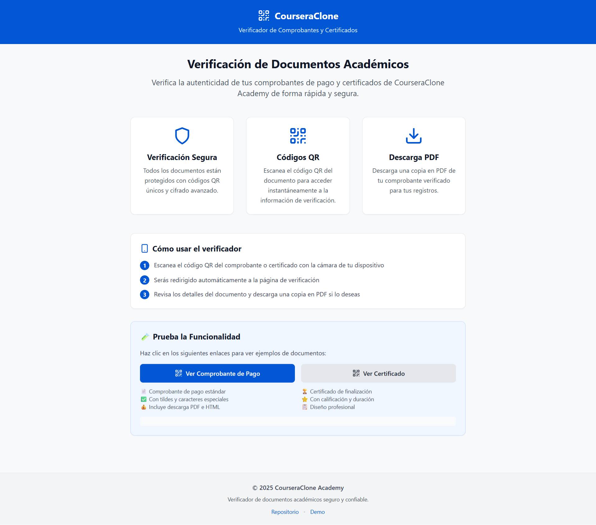

# WebServices for CourseraClone

Una aplicación web mobile-first para verificar comprobantes de pago y certificados del sistema CourseraClone mediante códigos QR.

<!-- Última actualización: Septiembre 2025 — mejoras PDF certificados, limpieza del repo y tips para PowerShell -->

## 🚀 Demo

**URL de producción:** https://trinity-bytes.github.io/WebServices-for-CourseraClone/

## 🖼️ Vista previa



### Prueba la funcionalidad

Prueba con este comprobante de ejemplo:

```text
https://trinity-bytes.github.io/WebServices-for-CourseraClone/verify/data?payload=eyJ0eXBlIjoicmVjZWlwdCIsImlkIjoxLCJzdHVkZW50IjoiRXN0dWRpYW50ZSBkZSBQcnVlYmEiLCJjb3Vyc2UiOiJDdXJzbyBkZSBQcm9ncmFtYWNpw7NuIiwiZGF0ZSI6IjIwMjQtMTItMTUiLCJhbW91bnQiOjk5Ljk5LCJjb3Vyc2VUeXBlIjoiY291cnNlIiwic3R1ZGVudElkIjoxMDAxLCJhY3Rpdml0eUlkIjoxMDF9
```

## 📱 Características

- **Mobile-First**: Optimizado para dispositivos móviles
- **Verificación QR**: Verifica documentos mediante códigos QR
- **Generación PDF**: Descarga comprobantes en formato PDF
- **Diseño Responsivo**: Se adapta a cualquier tamaño de pantalla
- **Rápido y Ligero**: Carga en menos de 3 segundos

## 🛠️ Tecnologías

- React 18 + TypeScript
- Vite (Build tool)
- Tailwind CSS (Styling)
- React Router (Navigation)
- html2canvas + jsPDF (Generación de PDF con alta fidelidad)
- Lucide React (Icons)
- GitHub Pages (Hosting)

## 🏗️ Instalación y Desarrollo

### Prerrequisitos

- Node.js 18 o superior
- npm o yarn

### Instalación

```bash
# Clonar el repositorio
git clone https://github.com/trinity-bytes/WebServices-for-CourseraClone.git

# Navegar al directorio
cd WebServices-for-CourseraClone

# Instalar dependencias
npm install
```

Nota (Windows PowerShell): si ves "running scripts is disabled on this system", ejecuta desarrollo así:

```powershell
cmd /c npm run dev
```

### Scripts disponibles

```bash
# Desarrollo
npm run dev

# Build para producción
npm run build

# Preview del build
npm run preview

# Linting
npm run lint

# Deploy a GitHub Pages
npm run deploy
```

## 📊 Estructura del Proyecto

```text
src/
├── components/
│   ├── ReceiptViewer.tsx          # Visualización de comprobantes
│   ├── CertificateViewer.tsx      # Visualización de certificados
│   ├── PDFGenerator.tsx           # Generación PDF para comprobantes
│   ├── CertificatePDFGenerator.tsx# Generación PDF para certificados
│   └── ErrorPage.tsx              # Página de errores
├── pages/
│   ├── HomePage.tsx               # Página principal
│   └── VerifyPage.tsx             # Página de verificación
├── types/
│   └── index.ts                   # Tipos TypeScript
├── utils/
│   └── dataParser.ts             # Parsing y validaciones de datos
├── App.tsx                        # Componente principal
├── main.tsx                       # Entry point
└── index.css                      # Estilos globales

scripts/                           # Scripts auxiliares
├── generate_payload.js            # Genera payload base64 (comprobante)
├── generate_certificate.js        # Genera payload base64 (certificado)
├── analyze_generator.js           # Analiza/valida payloads
├── cleanup_unused.ps1             # Limpia archivos sueltos obsoletos en la raíz
└── README.md

samples/                           # Ejemplos de payloads (JSON/base64)
├── simple_payload.json
├── test_payload.json
├── temp_payload.json
└── clean_payload.json

docs/                              # Documentación del proyecto
└── WebServices_Coursera_Especificaciones.md
```

## 🔗 Uso con Sistema C++

### Formato de URL

La aplicación espera URLs con el siguiente formato:

```text
https://trinity-bytes.github.io/WebServices-for-CourseraClone/verify/data?payload=[base64-encoded-json]
```

### Estructura de Datos

```json
{
  "type": "receipt",
  "id": 1,
  "student": "Estudiante de Prueba",
  "course": "Curso de Programación",
  "date": "2024-12-15",
  "amount": 99.99,
  "courseType": "course",
  "studentId": 1001,
  "activityId": 101
}
```

### Ejemplo de Implementación C++

```cpp
// Generar URL para QR
std::string generateReceiptURL(const ComprobanteDePago& comprobante) {
    nlohmann::json data = {
        {"type", "receipt"},
        {"id", comprobante.getId()},
        {"student", comprobante.getNombreEstudiante()},
        {"course", comprobante.getNombreCurso()},
        {"date", comprobante.getFechaEmision()},
        {"amount", comprobante.getMonto()},
        {"courseType", comprobante.getTipoCurso()},
        {"studentId", comprobante.getStudentId()},
        {"activityId", comprobante.getActivityId()}
    };

    std::string encodedData = base64_encode(data.dump());
    return "https://trinity-bytes.github.io/WebServices-for-CourseraClone/verify/data?payload=" + encodedData;
}
```

## 📱 Funcionalidades

### ✅ Implementadas

- [x] Página principal informativa
- [x] Parsing de datos desde URL
- [x] Visualización de comprobantes de pago
- [x] Generación y descarga de PDFs (comprobantes y certificados)
- [x] Diseño mobile-first responsivo
- [x] Manejo de errores
- [x] Deploy automático en GitHub Pages
- [x] Soporte completo para certificados (visualización y PDF)

### 🔄 Por Implementar (Fase 2)

- [ ] PWA (Progressive Web App)
- [ ] QR Scanner integrado
- [ ] Dark mode
- [ ] Multi-idioma

## 🎨 Diseño

El diseño sigue las especificaciones mobile-first con la paleta de colores de Coursera:

- **Primary**: #0056D3 (Azul Coursera)
- **Success**: #00C851 (Verde)
- **Error**: #FF4444 (Rojo)
- **Warning**: #FFBB33 (Amarillo)

## 📄 Licencia

Este proyecto está bajo la Licencia MIT. Ver el archivo `LICENSE` para más detalles.

## 👥 Contribución

1. Fork el proyecto
2. Crea una rama feature (`git checkout -b feature/AmazingFeature`)
3. Commit tus cambios (`git commit -m 'Add some AmazingFeature'`)
4. Push a la rama (`git push origin feature/AmazingFeature`)
5. Abre un Pull Request
